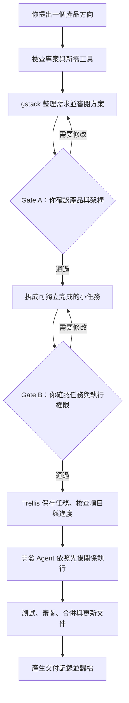

<a id="readme-top"></a>

<div align="center">
  <h1>Wish Builder</h1>
  <p>把一句產品想法，變成有規劃、有人把關、能逐步完成的軟體專案。</p>
</div>

Wish Builder 是一個給 Codex 使用的 Skill，也就是一套讓 Codex 按固定步驟工作的規則。你先說想做什麼，它會整理需求、提出產品與技術方案，再把工作拆成可以逐一完成的小任務。你確認方向後，它才會安排開發 Agent。這些 Agent 各自負責一項小任務，包括寫程式、測試、審閱和整理文件。

它不是「輸入一句話，直接交出一堆程式碼」的工具。產品方向和系統架構仍由人決定；重複而明確的工程工作，才交給 Agent 自動處理。

## 目錄

- [這個專案解決什麼問題](#這個專案解決什麼問題)
- [適合誰使用](#適合誰使用)
- [運作方式](#運作方式)
- [安裝](#安裝)
- [第一次使用](#第一次使用)
- [你需要做哪些決定](#你需要做哪些決定)
- [安全邊界](#安全邊界)
- [專案結構](#專案結構)
- [驗證工具](#驗證工具)
- [測試狀態](#測試狀態)
- [常見問題](#常見問題)
- [開發計劃](#開發計劃)
- [參與開發](#參與開發)
- [授權](#授權)

## 這個專案解決什麼問題

只把一個模糊想法交給 Agent，常見結果是：需求還沒想清楚就開始寫程式、各個 Agent 同時修改同一批檔案、做到一半才發現架構不合適，最後也說不清哪項需求由哪個改動完成。

Wish Builder 把過程分成兩部分：

1. **先把方向定清楚。** gstack 協助整理使用者、問題、範圍、設計和工程方案。人負責確認產品與架構。
2. **再讓 Agent 執行。** Trellis 保存任務內容與進度，總控 Agent 依照先後關係派工、檢查、合併和收尾。

這樣做的目標不是讓人完全消失，而是把人的時間留給真正重要的決定。

## 適合誰使用

Wish Builder 適合以下情況：

- 你有一個產品方向，但還沒有完整需求文件。
- 你願意在開工前確認產品範圍和系統架構。
- 你希望確認任務拆分後，Agent 能自行完成大部分工程工作。
- 專案可以拆成多個彼此較少衝突的小改動。
- 你需要保留需求、Issue、Pull Request、測試和文件之間的記錄。

以下情況通常不需要它：

- 只改一行文字或修一個很小的錯誤。
- 正在處理需要立刻人工介入的正式環境事故。
- 你不打算審閱產品方向、架構或高風險操作。

## 運作方式



流程會按以下順序進行：

1. **準備檢查**：確認 Git、gstack、Trellis、測試指令和可用的 Agent 數量。
2. **需求整理**：依序使用 `office-hours`、`plan-ceo-review`、`plan-eng-review`，有畫面時再使用 `plan-design-review`。
3. **Gate A**：你確認要做什麼、不要做什麼，以及系統各部分如何分工。
4. **任務拆分**：先處理共用介面和基礎資料，再平行開發互不衝突的部分，最後串起整個產品。
5. **Gate B**：你確認完整任務表、先後關係、測試方法、合併順序和 Agent 可使用的權限。
6. **自動執行**：總控 Agent 派出開發 Agent。每個小任務對應一個 Issue（工作單）和一個 Pull Request（程式碼變更單）。
7. **收尾**：執行整體測試、畫面檢查、文件更新和需求追蹤，最後由 Trellis 歸檔。

Wish Builder 只使用一個總控排程。它不會同時讓 Trellis `/parallel` 和另一套 Agent 排程處理同一批任務，避免重複派工和互相覆蓋。

## 安裝

### 使用前準備

目標專案需要：

- 支援 Skills 的 Codex
- Git 專案
- [gstack](https://github.com/garrytan/gstack)
- [Trellis](https://github.com/mindfold-ai/Trellis)
- Node.js 18 或以上版本
- Python 3.11 或以上版本

只有需要建立遠端 Issue 和 Pull Request 時，才需要 GitHub 或其他程式碼託管平台的存取權。

如果缺少工具，Wish Builder 會先列出缺少的項目和安裝方式。它不會自行安裝全域工具、登入帳號或修改專案設定。

### 方法一：從 GitHub 安裝

把本專案發布到 GitHub 後，將 `<OWNER>` 和 `<REPO>` 換成實際名稱，再在 Codex 中輸入：

```text
Use $skill-installer to install
https://github.com/<OWNER>/<REPO>/tree/main/wish-builder
```

安裝完成後，從下一個 Codex 對話開始即可使用 `$wish-builder`。

### 方法二：安裝 ZIP

先下載 [wish-builder-skill.zip](wish-builder-skill.zip)。ZIP 內已包含正確的頂層 `wish-builder/` 目錄。

Windows PowerShell：

```powershell
Expand-Archive .\wish-builder-skill.zip -DestinationPath "$env:USERPROFILE\.codex\skills"
```

macOS 或 Linux：

```bash
mkdir -p ~/.codex/skills
unzip wish-builder-skill.zip -d ~/.codex/skills
```

安裝後應該可以看到：

```text
~/.codex/skills/wish-builder/SKILL.md
```

目前 ZIP 的 SHA-256：

```text
64b2c0123b1fb856d9641a29045507e15eb332c6f977a8829effcd5bd63585a3
```

## 第一次使用

1. 在 Codex 開啟你想開發的 Git 專案。
2. 輸入一個簡短方向，例如：

   ```text
   Use $wish-builder in this repository.

   我想做一個給兩位室友使用的共同記帳工具。
   先做本機版本，不需要付款或銀行連接。
   我確認產品架構和任務拆分後，你可以自行完成開發；
   只有方向跑偏、高風險操作或需要正式部署時才停下來問我。
   ```

3. Wish Builder 會先檢查環境，再準備 Gate A。這時還不會修改產品程式碼。

你不需要一開始就寫完整需求。產品使用者、主要問題、成功標準和不做的項目，會在 Gate A 前逐步整理出來。

## 你需要做哪些決定

| 決定點 | 什麼時候出現 | 你要確認什麼 |
| --- | --- | --- |
| Setup Gate | 缺少工具或需要登入時 | 是否安裝、初始化、登入或修改專案設定 |
| Gate A | 寫程式之前 | 產品目標、範圍、系統架構、資料與安全設計 |
| Gate B | 派出開發 Agent 之前 | 任務拆分、先後關係、測試、合併方式和執行權限 |
| Gate C | 需要正式部署時 | 部署位置、風險和回復方式 |
| 偏離提醒 | 執行結果超出已核准內容時 | 是否改變範圍、架構、公開介面或安全邊界 |

Gate A 和 Gate B 都需要你明確回覆「通過」或列出修改內容。原始願望不等於核准。

## 安全邊界

在 Gate B 通過前，Wish Builder 不會：

- 修改產品程式碼
- 建立遠端 Issue 或 Pull Request
- 派出 Agent 進行實作

未取得額外同意時，它也不會：

- 索取、保存或更換登入資料
- 付款或修改帳單
- 部署到正式環境
- 刪除正式資料或降低存取權限
- 執行無法回復的資料轉換
- 改變已核准的產品方向、架構或公開介面

一般的程式寫法、小型修正和測試失敗，會由總控 Agent 自行處理。只有超出已核准範圍，或同一任務連續失敗時，才會重新找你決定。

## 專案結構

```text
.
|-- README.md                              專案首頁與使用說明
|-- pyproject.toml                         Python 套件與 wishctl 指令設定
|-- wish_builder/                          正式 Python 原始碼
|-- scripts/                               相容啟動器與 ZIP 建置工具
|-- tests/                                 Repository 基線與 wishctl 測試
|-- src/WishBuilder.CredentialService/     Windows credential service 骨架
|-- release/provenance/                    .NET 版本與支援期限證據
|-- wish-builder-skill.zip                 可直接分發的 Skill 壓縮檔
`-- wish-builder/                     可獨立安裝的 Skill
    |-- SKILL.md                      主流程與兩個人工決定點
    |-- agents/openai.yaml            Codex 顯示名稱與預設提示
    |-- references/
    |   |-- artifact-contracts.md     任務、核准文件與追蹤格式
    |   |-- execution.md              派工、合併、失敗處理與恢復
    |   |-- policy.md                 權限、安全和文件規則
    |   `-- tool-bridges.md           gstack、Trellis 和 Agent 的分工
    `-- scripts/
        |-- wishctl.py                任務計劃驗證工具
        `-- test_wishctl.py           自動測試
```

想了解完整執行規則，可以直接閱讀 [wish-builder/SKILL.md](wish-builder/SKILL.md)。

## 驗證工具

`wishctl.py` 是一個不需要額外 Python 套件的檢查工具。它把容易出錯的規則做成固定檢查，而不是只靠 Agent 記住。

| 指令 | 用途 |
| --- | --- |
| `validate` | 檢查核准記錄、任務依賴、檔案範圍、Issue/PR 對應、測試和回復方式 |
| `ready` | 找出目前可以開始，而且不會互相衝突的任務 |
| `drift` | 檢查某個 Agent 是否修改了不屬於該任務的檔案 |
| `trace` | 產生「需求到任務、Issue、PR、測試和合併結果」的對照表 |
| `hash` | 計算 Gate A 或 Gate B 文件的 SHA-256，確認核准的是同一份內容 |

查看全部指令：

```bash
python scripts/wishctl.py --help
```

檢查一份任務計劃：

```bash
python scripts/wishctl.py validate path/to/execution-manifest.json --stage planning
```

只安裝 Skill ZIP 時，也可以繼續使用
`python wish-builder/scripts/wishctl.py`；兩個入口使用同一份程式碼。

## 測試狀態

目前版本已完成：

- Codex 官方 Skill 格式驗證
- 官方 Skill 安裝器目錄驗證
- 21 個 repository 自動測試
- 13 個可獨立執行的 Skill 內部測試
- 2 個 .NET fail-closed baseline 測試
- Python 編譯檢查
- Python source distribution 與 wheel 建置
- ZIP 完整性與頂層目錄檢查
- 3 種流程試跑：缺少工具、舊計劃出現循環或檔案衝突、全新專案停在 Gate A

自行執行測試：

```bash
python -m unittest discover -s tests -v
cd wish-builder/scripts
python -m unittest -v test_wishctl.py
```

Windows credential service 目前仍是遇到未實作功能便停止的骨架，但工具鏈基線已完成：
Repository 固定 `.NET 10.0.400`、`net10.0-windows`、`win-x64`、Microsoft
test packages 和兩份 NuGet lockfile；clean-cache locked restore、0 warning Release build、
2 個測試及兩次相同 SHA-256 的 self-contained single-file publish 均已通過。真正的
Windows Service、CNG key 和 named-pipe 功能尚未實作，啟動時仍會回傳
`SETUP_REQUIRED`。

## 常見問題

### 一定要會寫程式才能使用嗎？

不一定。你需要能判斷產品方向是否正確，也需要看懂 Gate A 和 Gate B 的重點。程式實作可以交給 Agent，但涉及使用者、資料、安全和成本的決定仍應由人負責。

### 它可以全程完全無人看管嗎？

不可以，也不建議。正常情況下你至少要處理 Gate A 和 Gate B。通過後，大部分日常工程工作可以自動進行；方向改變、高風險操作或正式部署仍會停下來確認。

### 可以用在已經有程式碼的專案嗎？

可以。Wish Builder 會先查看現有文件、測試、Git 狀態和 Trellis 任務。它會保留與目前工作無關的修改，也會在恢復舊任務時重新核對實際狀態。

### 沒有 GitHub 可以使用嗎？

可以先在本機規劃和執行。需要建立 Issue、Pull Request 或自動合併時，才需要對應平台的權限。

### 為什麼不直接使用 gstack `autoplan`？

這個專案要求架構由人把關。`office-hours` 和各項 plan review 會提供建議，但 Gate A 必須由人核准，因此不使用會自動做完早期決定的 `autoplan`。

### 中斷後可以繼續嗎？

可以。進度、決定、任務狀態和核准記錄都會保存在 Trellis 的父任務中。下次啟動時會先核對 Git、任務、Issue、Pull Request 和測試結果，再從正確階段繼續。

## 開發計劃

- [x] 完成 gstack、Trellis 和多 Agent 的分工流程
- [x] 加入 Gate A、Gate B 和部署前 Gate C
- [x] 加入任務依賴、檔案範圍與需求追蹤驗證
- [x] 完成三種邊界情況試跑
- [x] 建立 Python 套件、相容指令、可重現 Skill ZIP 和第一版 CI
- [x] 完成 .NET 10 locked restore、測試與可重現 publish 基線
- [ ] 實作 Windows Service、CNG key 和 authenticated named-pipe
- [ ] 實作執行核心、Trellis adapter 和受監督的 Agent 排程
- [ ] 選擇開源授權並發布正式 GitHub 儲存庫
- [ ] 在真實專案完成一次從願望到全部 Pull Request 合併的公開案例

## 參與開發

提出修改前，請先說明它解決的實際問題。涉及流程的改動應同時更新 `SKILL.md`、相關 reference 和測試；涉及 `wishctl.py` 的改動應加入可以重現問題的測試案例。

建議流程：

1. Fork 專案。
2. 建立一個範圍清楚的分支。
3. 修改並執行測試。
4. 開啟 Pull Request，說明改了什麼、如何驗證，以及是否影響兩個 Gate。

請不要在沒有替代安全措施的情況下移除人工核准點、檔案範圍檢查或失敗時的停止規則。

## 授權

本專案目前尚未選擇開源授權。正式公開發布前需要加入 `LICENSE`；在此之前，程式碼不會自動取得自由使用、修改或再發布的權利。

## 致謝

- [gstack](https://github.com/garrytan/gstack)：提供產品、工程、設計、審閱和 QA 流程。
- [Trellis](https://github.com/mindfold-ai/Trellis)：保存任務內容、執行步驟、檢查記錄和歸檔。
- [Best README Template](https://github.com/othneildrew/Best-README-Template)：本 README 的章節結構參考來源。

<p align="right"><a href="#readme-top">回到頂部</a></p>
